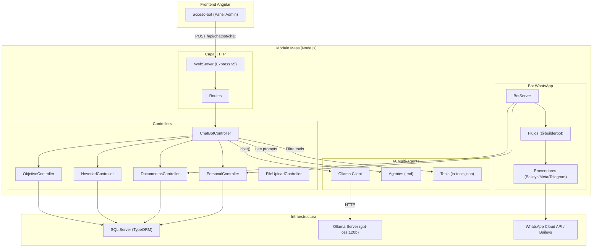
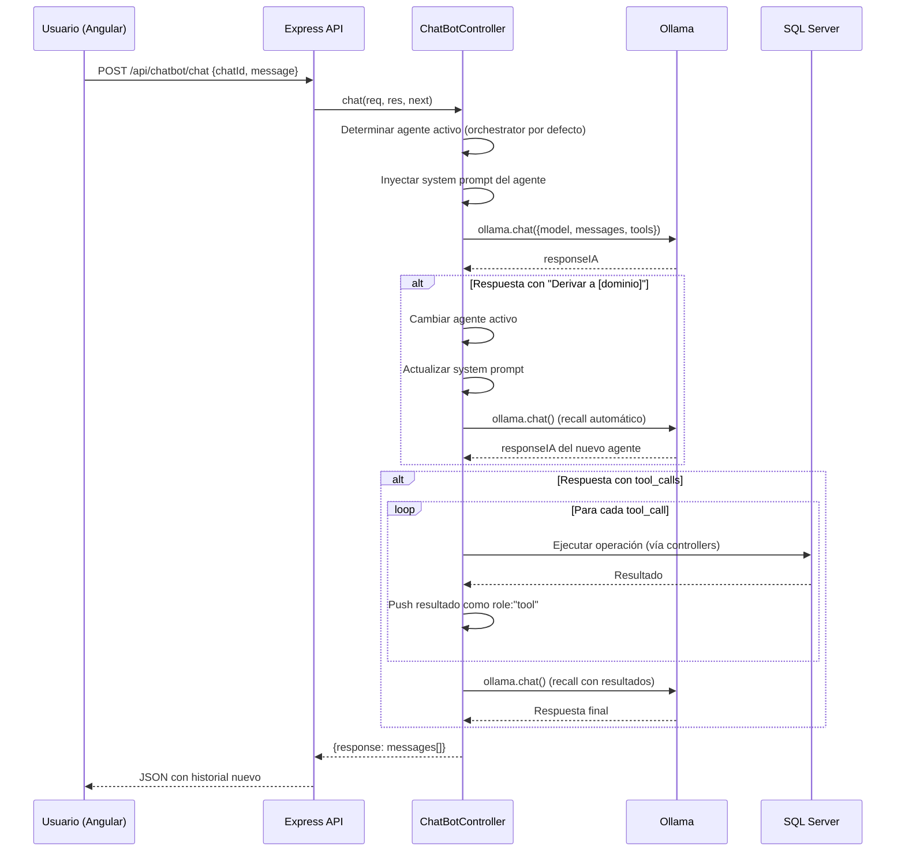
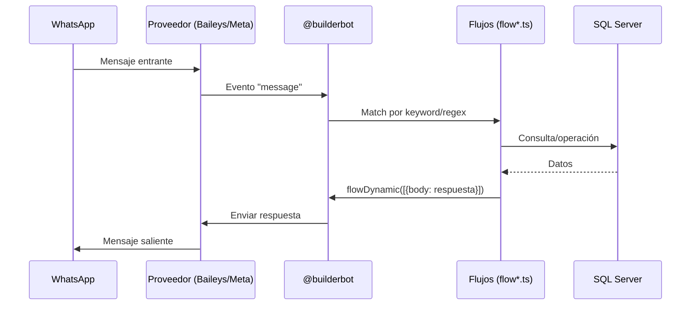

# Arquitectura del Módulo Mess

## Diagrama de Componentes

## Capas del Sistema

### 1. Capa HTTP (`server.ts`, `routes/`)
- **WebServer**: Instancia Express que escucha en `SERVER_API_PORT`.
- **Rutas**: Todas protegidas con `authMiddleware.verifyToken` + `authMiddleware.hasGroup(['gSistemas'])`.
- El middleware de autenticación valida tokens JWT emitidos por el backend principal (`back/`).

### 2. Capa de Controllers (`controller/`)

Cada controller extiende `BaseController` que provee:
- `jsonRes()`: Respuesta JSON estandarizada.
- `getURLDocumentoNew()`: Generación de URLs de descarga de documentos.
- Acceso a `pathDocuments` para lectura de archivos de configuración.

#### ChatBotController — El controller central de IA
Responsable de toda la lógica de interacción con Ollama. Ver detalle completo en [multi-agent-system.md](multi-agent-system.md).

#### PersonalController
Gestión de datos personales del asociado:
- `getPersonaState(chatId)` → Estado de autenticación por teléfono.
- `genTelCode(chatId)` → Generación de código de verificación.
- `removeCode(chatId)` → Eliminación de código tras verificación exitosa.
- `delTelefonoPersona(chatId)` → Desvinculación de teléfono.
- `getInfoPersonal(personalId, chatId)` → Datos personales completos.
- `getInfoEmpresa()` → Datos institucionales.
- `getDocsPendDescarga(personalId)` → Documentos pendientes.
- `getPersonalAdelanto()` / `setPersonalAdelanto()` / `deletePersonalAdelanto()` → CRUD de adelantos.

#### DocumentosController
Consulta de documentos para descarga:
- `getLastPeriodosOfComprobantesAFIP(personalId, cant)` → Últimos períodos de monotributo.
- `getLastPeriodoOfComprobantes(personalId, cant)` → Últimos recibos de sueldo.

#### NovedadController
Gestión completa de novedades/incidentes:
- `getBackupNovedad(personalId)` → Recuperar novedad en caché (reportes inconclusos).
- `saveNovedad(personalId, novedad)` → Guardado progresivo.
- `getNovedadTipo()` → Catálogo de tipos de novedad.
- `addNovedad(novedad, chatId, personalId)` → Confirmación y envío del reporte.
- `getNovedadesPendientesByResponsable(personalId)` → Listado de pendientes.
- `setNovedadVisualizacion(...)` → Marcar como vista.

#### ObjetivoController
- `getObjetivoByCodObjetivo(codObjetivo)` → Validación de código de objetivo.

### 3. Capa Bot WhatsApp (`bot-server.ts`, `flow/`)

`BotServer` es la clase principal que:
- Inicializa el proveedor de WhatsApp según `process.env.PROVIDER`.
- Registra todos los flujos de `@builderbot` en `init()`.
- Mantiene la instancia de Ollama y el prompt/tools en memoria.
- Gestiona la cola de mensajes y el envío proactivo.

#### Proveedores soportados
| Proveedor | Clase | Uso |
|---|---|---|
| `BAILEY` | `BaileysProvider` | WhatsApp Web (scraping) |
| `META` | `MetaProvider` | WhatsApp Cloud API oficial |
| `TELEGRAM` | `TelegramProvider` | Telegram Bot API |
| `DUMMY` | `null` | Sin proveedor (solo API HTTP) |

### 4. Capa de Datos (`data-source.ts`, `sqlserver-database/`)
- TypeORM conecta a SQL Server.
- `sqlserver-database/` contiene un adaptador personalizado de `@builderbot` para persistir sesiones del bot en SQL Server (en lugar de MemoryDB).

## Flujo de Datos — Chat de Prueba (IA)

## Flujo de Datos — Bot WhatsApp (Producción)

